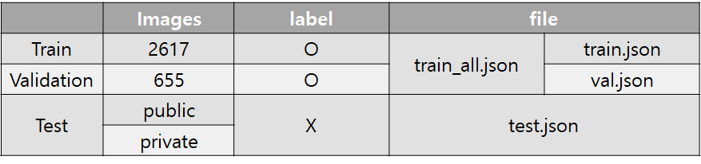

# 🚀[LEVEL3 P stage2] 언제오르조

## 🔥 Member 🔥
<table>
  <tr height="125px">
    <td align="center" width="120px">
      <a href="https://github.com/kimkihoon0515"></a>
    </td>
    <td align="center" width="120px">
      <a href="https://github.com/ed-kyu"></a>
    </td>
    <td align="center" width="120px">
      <a href="https://github.com/GwonPyo"></a>
    </td>
    <td align="center" width="120px">
      <a href="https://github.com/ysw2946"></a>
    </td>
    <td align="center" width="120px">
      <a href="https://github.com/jsh0551"></a>
    </td>
    <td align="center" width="120px">
      <a href="https://github.com/YJ0522771"></a>
    </td>

  </tr>
  <tr height="70px">
    <td align="center" width="120px">
      <a href="https://github.com/kimkihoon0515">김기훈</a>
    </td>
    <td align="center" width="120px">
      <a href="https://github.com/ed-kyu">김승규</a>
    </td>
    <td align="center" width="120px">
      <a href="https://github.com/GwonPyo">남권표</a>
    </td>
    <td align="center" width="120px">
      <a href="https://github.com/ysw2946">유승우</a>
    </td>
    <td align="center" width="120px">
      <a href="https://github.com/jsh0551">장수호</a>
    </td>
    <td align="center" width="120px">
      <a href="https://github.com/YJ0522771">조유진</a>
    </td>
  </tr>
</table>

## 🔍Project Overview
바야흐로 대량 생산, 대량 소비의 시대. 우리는 많은 물건이 대량으로 생산되고, 소비되는 시대를 살고 있습니다. 하지만 이러한 문화는 '쓰레기 대란', '매립지 부족'과 같은 여러 사회 문제를 낳고 있습니다.  
  분리수거는 이러한 환경 부담을 줄일 수 있는 방법 중 하나입니다. 잘 분리배출 된 쓰레기는 자원으로서 가치를 인정받아 재활용되지만, 잘못 분리배출 되면 그대로 폐기물로 분류되어 매립 또는 소각되기 때문입니다.

따라서 우리는 사진에서 쓰레기를 Segmentation하는 모델을 만들어 이러한 문제점을 해결해보고자 합니다. 문제 해결을 위한 데이터셋으로는 배경, 일반 쓰레기, 플라스틱, 종이, 유리 등 11 종류의 쓰레기가 찍힌 사진 데이터셋이 제공됩니다.

여러분에 의해 만들어진 우수한 성능의 모델은 쓰레기장에 설치되어 정확한 분리수거를 돕거나, 어린아이들의 분리수거 교육 등에 사용될 수 있을 것입니다. 부디 지구를 위기로부터 구해주세요! 🌎

- **Input :** 쓰레기 객체가 담긴 이미지가 모델의 인풋으로 사용됩니다. segmentation annotation은 COCO format으로 제공됩니다.
- **Output :** 모델은 pixel 좌표에 따라 카테고리 값을 리턴합니다. 이를 submission 양식에 맞게 csv 파일을 만들어 제출합니다.

## 🗂️ Dataset
- Train Images : 3272
- Test Images : 624
- 11 class : Background, General trash, Paper, Paper pack, Metal, Glass, Plastic, Styrofoam, Plastic bag, Battery, Clothing
- Image Size : 512x512

## 🧱Structure
├── baseline  
│   ├── baseline_fcn_resnet50.ipynb  
│   ├── rquirements.txt   
│   ├── utils.py    
│   ├── viz.py      
│   └── requirements.txt      
│     
├── mmsegmentation          
│   ├── deeplab3          
│   ├── deeplab3plus            
│   ├── fcn_hrnet             
│   ├── fpn             
│   ├── knet             
│   ├── ocrnet_hrnet             
│   └── upernet_convnext             
├── inference.ipynb       
└── train.ipynb       



## 🧪Experiments

| Backbone  | Architecture | public mIoU | private mIoU | Pseudo Labeling |
| :------: | :------: | :------: | :------: | :------: |
| Swin-L  | knet+upernet | 0.8123 | 0.7445 | ○ |
| ConvNext XL | upernet | 0.8181 | 0.7443 | ○ |
| ConvNext XL | knet+upernet  | 0.8225 | 0.7527 | △ |
| BEiT-L | upernet  | 0.7742 |  0.7293 | ○ |
| SVT-L | upernet | 0.8148 |  0.7423 | ○ |

#### [참고]

Pseudo Labeling(○): 기본 Pseudo Labeling 기법으로 학습 <br>
Pseudo Labeling(△): 학습의 절반은 Pseudo Labeling을 사용하고 이후 절반은 사용하지 않은 기본 데이터셋으로 학습

## 🏆Result

### 최종 제출 모델

| Backbone | Architecture | public mIoU | private mIoU |
| :------: | :------: | :------: | :------: |
| ConvNext XL | knet+upernet | 0.8225 | 0.7527 |
| Hard voting ensemble | x | 0.8205 | 0.7475

### Hard Voting Ensemble에 사용한 모델들

| Backbone  | Architecture | public mIoU |
| :------: | :------: | :------: |
| ConvNext XL | upernet | 0.8181 |
| ConvNext XL | knet+upernet | 0.8225 |
| Swin-L | knet+upernet | 0.8123 |
| SVT-L | upernet | 0.8148 |

### 리더보드 결과
- 총 19 팀 참여
- Public : 3등 -> Private : 6등
- Public : 0.8225 -> Private : 0.7527


## 💡Usage

### Install Requirements
```
pip install -r requirements.txt
```

